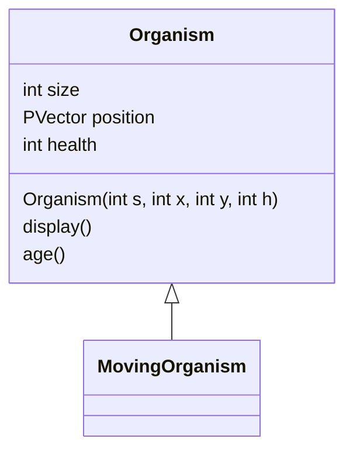

# Aquarium Lab
#### Thinker Name:
#### Period:

---
### Instructions
Before break, your work involved making 5 classes in a class hierarchy to be placed inside a fish tank program. for this lab, you will create the fish tank program and use the classes you created in it. Your submission must have the following components:
- The class hierarchy as described in [work09](https://github.com/ap251/gymboratorio/tree/main/assignments/w09), including the superclasses `Organism`, `MovingOrganism`, and the three custom subclasses.
  - All fields and methods should be used in some significant way (i.e. the `health` field and `age()` method present in `Organism` should have some effect on the objects), including fields and methods you add to your subclasses.
- Modify this README.md file to include the full class hierarchy UML diagram for your `Organism` tree. (further instructions below).
- A `Tank` class that should be able to:
  - Store organisms using either array(s) or `ArrayList`(s).
  - Have a well-defined "floor" section and a well-defined "water" section. Instances of a subclass should either remain confined to the water zone (like a fish) or to the floor (like a crab), _or_ move differently depending on zone (like a turtle).
  - Control the organisms contained within.
- A driver file that will:
  - Create a new tank.
  - Populate the tank with some number of organisms (may be handled by tank constructor at Thinker's discretion).
  - Provide a way to add new organisms to the tank as follows:
    - Clicking the mouse will add an organism at the current mouse pointer position.
    - The type of organism to be add should be set by pressing the number keys (_i.e._ `1` for fish, `2` for turtle, `3` for plant.)
    - The current type of organism to be added should be displayed in the upper left corner of the screen.

### Class Hierarchy Diagram
Once again, you will use Mermaid to create the UML class hierarchy diagram for your classes.
- You can find documentation on how to make these diagrams [here](https://mermaid.js.org/syntax/classDiagram.html)
- Live editor [here](https://mermaid.live/edit)
- Below is the beginning of your diagram:

